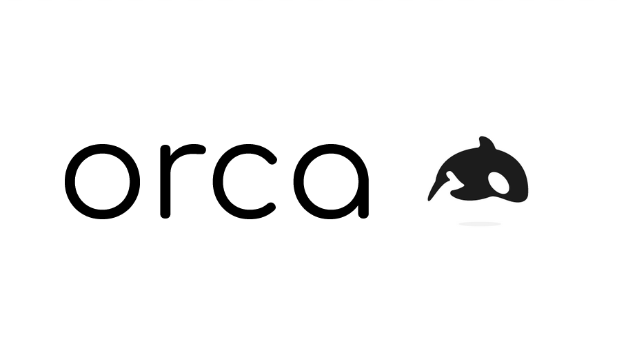

# 

A Node.js library to 'orca'-strate automated performance testing with a single API. Orca is a modern tool built for all aspects of performance testing, giving teams the ability to tests all layers of the application stack. Conduct simple load tests, run end-to-end performance tests, audit page load times, gather resource bundle metrics, and more.
